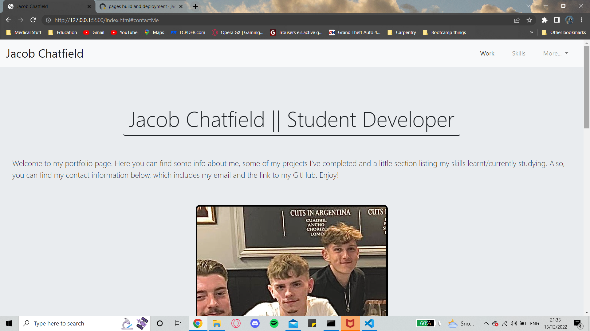
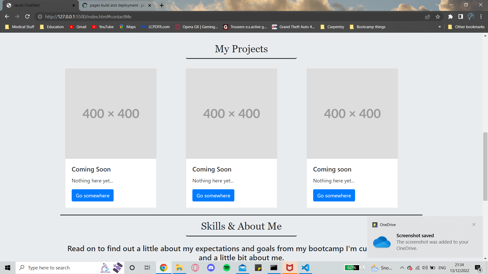
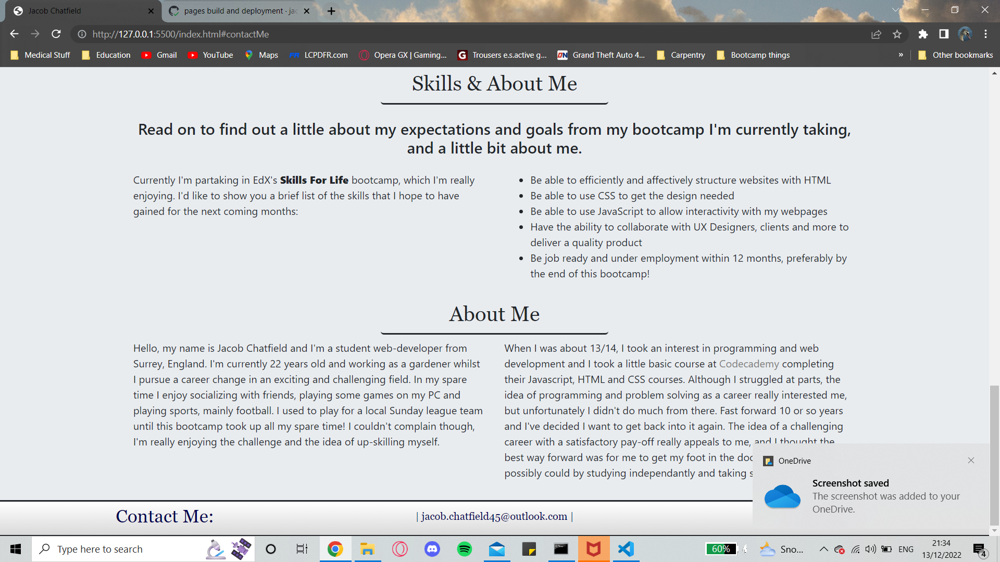

# Portfolio Site - BootStrap

## Description

Here is my portfolio webpage, describing myself and my work as well as a couple extras. This webpage is mainly powered by BootStrap!

## Table of Contents (Optional)

- [Installation](#installation)
- [Usage](#usage)
- [Credits](#credits)
- [License](#license)

## Installation

Just open up the webpage. You can see it deployed at https://jacobchat45.github.io/portfolio-challenge-2/

## Usage

## Credits

Bootstrap for providing easy techniques on webpage components & layouts.

## License

GNU General Public License v3.0
